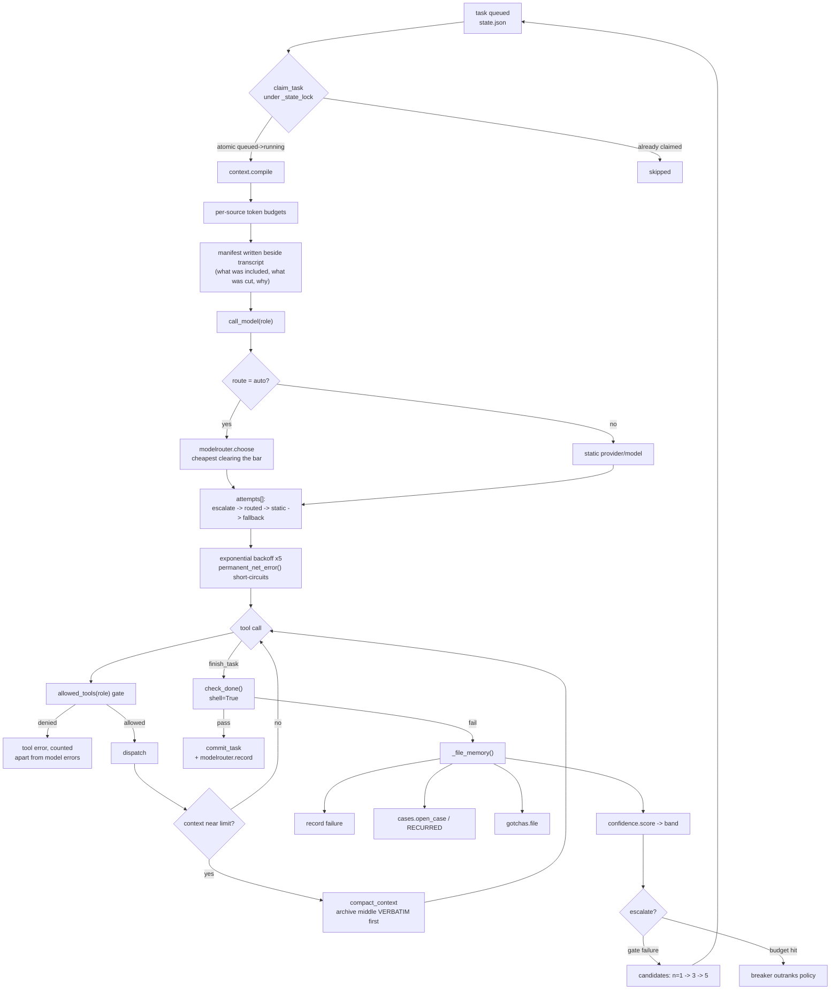
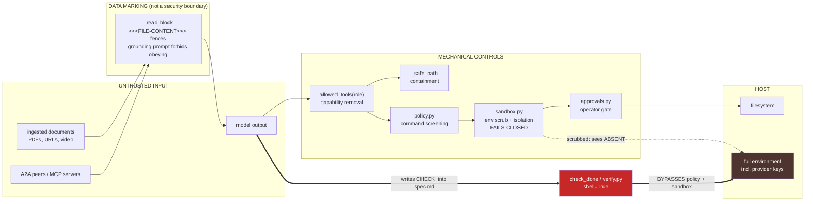
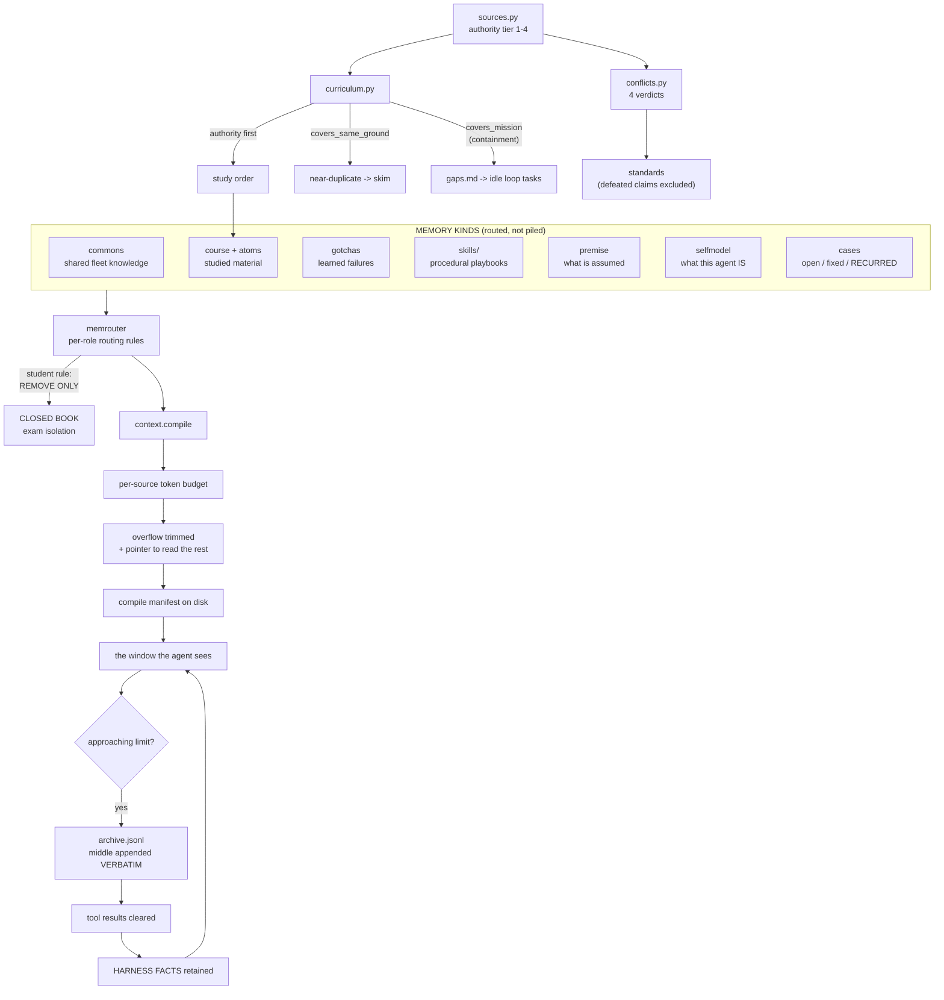
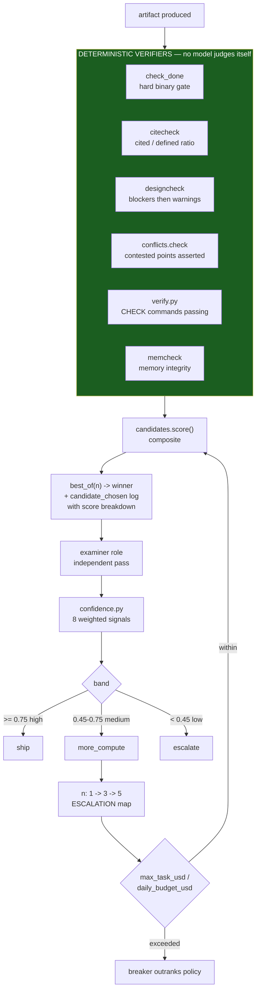
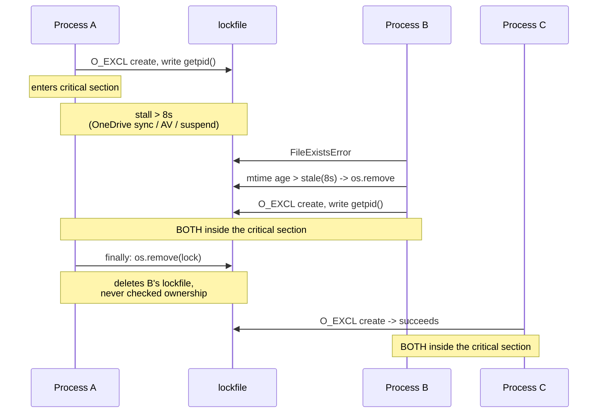
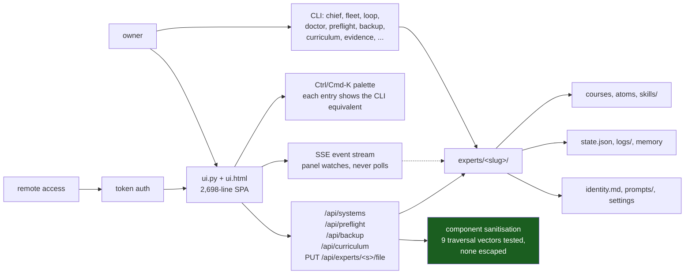
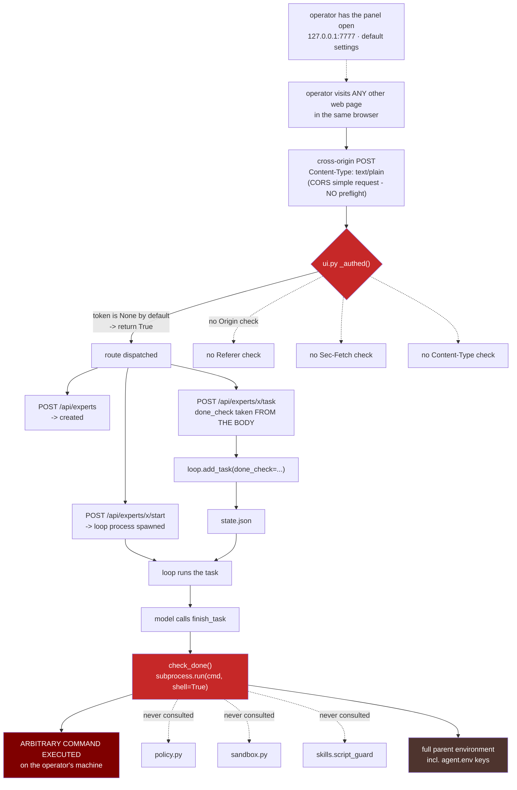
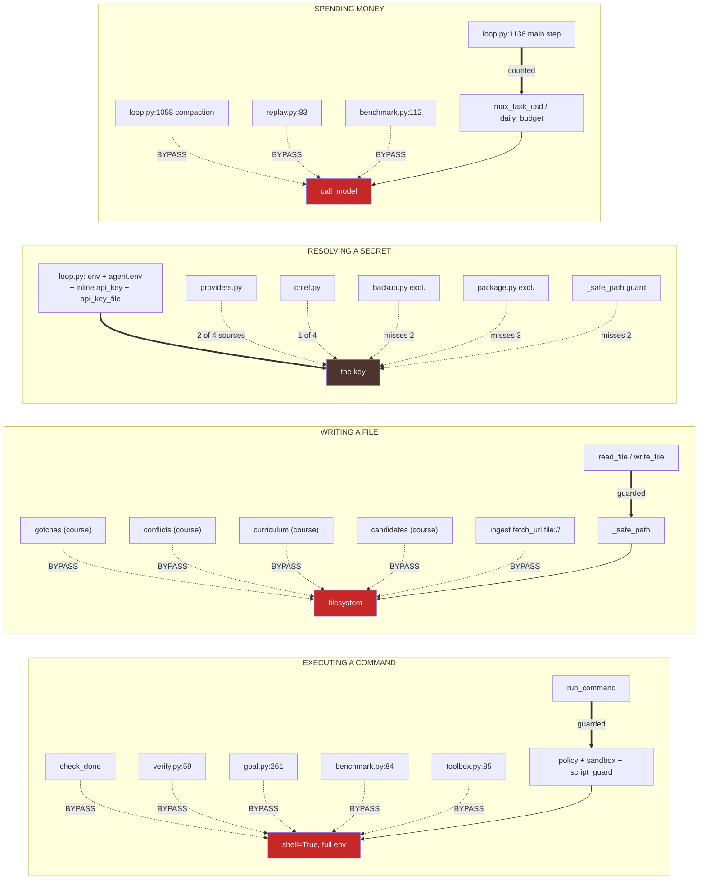
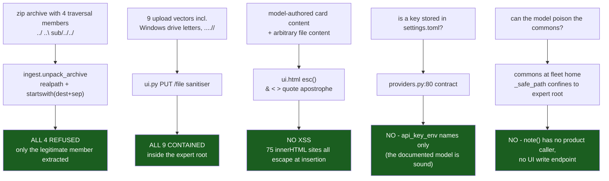

# System Diagrams

Diagrams reconstructed from source during the forensic audit. Where a diagram
shows a defect, it is marked and cross-referenced to
`GAPS_RISKS_AND_UNFINISHED.md`. Nothing here is aspirational — these describe
what the code does, including where that differs from what the docs say.

---

## 1. Task lifecycle



**Note on the gate.** `check_done` is drawn deliberately at the end of the
trusted path. It runs with `shell=True`, executing commands the *model* wrote
into `spec.md`, and it does not pass through `policy.py` or `sandbox.py`. See
diagram 2.

---

## 2. Trust boundaries — where controls apply, and where they do not



**The thick red path is P1-1, and it is reproduced.** In an isolated test the
gate path saw a planted environment marker; the normal `run_command` path saw
`ABSENT`. Every control in the middle column applies to the work path and none
of them applies to the verification path.

**On the fence.** `_read_block` is drawn *outside* the mechanical controls on
purpose. It is a prompt instruction. It raises the cost of a naive injection
and prevents nothing.

---

## 3. Memory architecture



**Closed-book has two layers of different strength.** The `memrouter` rule is
code and can only remove sources. The second layer — `[roles.student] tools`
omitting `read_file` — is *configuration*, and no test asserts it (P2-3).

---

## 4. Verification and governance stack



The green block is the build's strongest design decision: competing attempts
are scored by deterministic modules that already existed, not by asking a model
which attempt it prefers. The limitation is that these verifiers measure
**shape** (is a citation present and well-formed) rather than **truth** (does
the citation support the claim).

---

## 5. Concurrency — and the ownership hole



**P1-2.** Both `locks.holding()` and `loop._state_lock()` write `os.getpid()`
into the lockfile and **never read it back**. The data needed to detect this is
on disk and unused. These locks protect `effects.jsonl`, `approvals.json`,
`prospective.json`, `skills/graph.json` and `state.json`.

`locks.py` has **no test at all** — `tests/test_lock.py` tests a different
mechanism, the course lock inside `loop.py` (P1-3).

---

## 6. Module topology — the hub

```
                          ┌──────────────────────────┐
                          │        loop.py           │
                          │  2,080 lines             │
                          │  imported by 22 modules  │
                          │                          │
                          │  task schema             │
                          │  claim protocol          │
                          │  _state_lock             │
                          │  _safe_path              │
                          │  check_done   ◄── P1-1   │
                          │  call_model              │
                          │  compact_context         │
                          │  tool dispatch           │
                          │  _file_memory            │
                          └────────────┬─────────────┘
                                       │
      ┌──────────────┬─────────────────┼─────────────────┬──────────────┐
      │              │                 │                 │              │
 harness-loop     memory          governance        control-plane   work-systems
   9 modules     12 modules       11 modules         13 modules      6 modules
      │              │                 │                 │              │
 harness        memory/skills     variants           ui/chief        goal
 policy         commons/recall    approvals          doctor          workflows
 effects        gotchas/premise   replay             bootstrap       consult
 locks   ◄─P1-2 sources           benchmark          preflight       prospective
 checkpoint     conflicts         verify   ◄── P1-1  backup          routines
 sandbox ◄─P1-1 standards         citecheck          providers       research
 context        selfmodel         memcheck           toolbox
 memrouter      curriculum        designcheck        mcp    ◄── P2-1
                cases             candidates         federation
                                  evidence           trace/uicards
                                  confidence         modelrouter ◄── P1-4
```

Everything except `loop.py` is small and single-purpose. That concentration is
the build's principal maintainability risk: it is the file most likely to
produce an unanticipated effect when changed, and the file with the most
reasons to change.

---

## 7. Control plane



The green node is a **negative** finding worth recording: I hypothesised a path
traversal in the upload endpoint and attacked it with nine vectors including
Windows drive letters, `../`, `..\`, absolute POSIX paths and dot-collapse.
Every one resolved inside the expert root. The control holds.

---

## Diagram legend

| Marking | Meaning |
|---|---|
| Red node / thick edge | Confirmed defect, cross-referenced to a P-number |
| Green node | Control verified to hold under attack |
| `◄── P1-x` | Module carries the referenced finding |
| Dotted edge | Scrubbed, filtered, or read-only relationship |

---

## 8. The CSRF → RCE chain (reproduced end-to-end)

The audit's most severe finding. Every edge below was executed against an
isolated sandbox panel with synthetic values.



**Proof obtained:** the marker file `RCE via cross-origin POST done_check` was
written by the host after three cross-origin POSTs. `intention`, `workflow`,
and `wake` accept `done_check` by the same route, so the payload can also be
stored and fired later.

---

## 9. The secondary-path map — every control and what goes around it

This is the audit's central structural finding, drawn as one picture. Solid
green = the path the control's author defended. Red dashed = a path that
reaches the same operation without passing the control.



**Count:** command execution — 1 guarded path, 5 unguarded. Filesystem writes —
1 guarded, 5 unguarded. Credential resolution — 6 subsystems, 4 sources, no two
agreeing. Spend — 1 counted, 3 uncounted.

**The shape of the fix.** Not seventeen patches: three gateways — one to
execute a command, one to write a file, one to resolve a secret — that every
caller must pass through. That single change retires most of this report.

---

## 10. Controls verified to hold under attack

Reported with equal weight, because an audit that draws only failures is not
measuring itself.



One hypothesis in this set was mine and wrong: I flagged `ui.html:1305-07` as
an unescaped interpolation and found the call site escapes it one level up
(`${esc(when(x.when))}`). Recorded as a falsified hypothesis, not a finding.
